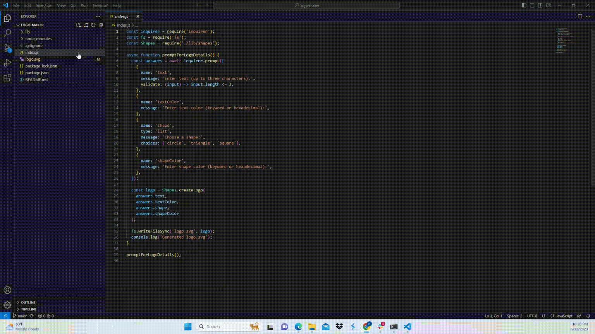

# Logo-Maker


## Resources
* https://developer.mozilla.org/en-US/docs/Web/API/Window/sessionStorage

# Technologies Used
This webpage consist of the following technologies:
<br>1. Node.js
<br>2. SVG previewer

# Links Used
* https://developer.mozilla.org/en-US/docs/Web/JavaScript/Reference/Statements/async_function
* https://developer.mozilla.org/en-US/docs/Web/JavaScript/Reference/Classes
* https://www.npmjs.com/package/inquirer
* https://developer.mozilla.org/en-US/docs/Web/JavaScript/Reference/Classes/static
* https://nodejs.org/api/modules.html#moduleexports
* https://stackoverflow.com/questions/46742842/what-is-the-actual-use-of-tocontain-in-expect
* https://jestjs.io/docs/expect

## Notes

```
I was not able to do a lot of commits because I got a new laptop and the push command was not working
```


## Example presentation Demonstration


## Deployed link
```
please find the deployed link below:
```
* https://hkchebli.github.io/logo-maker